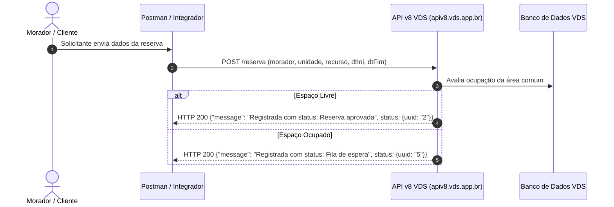
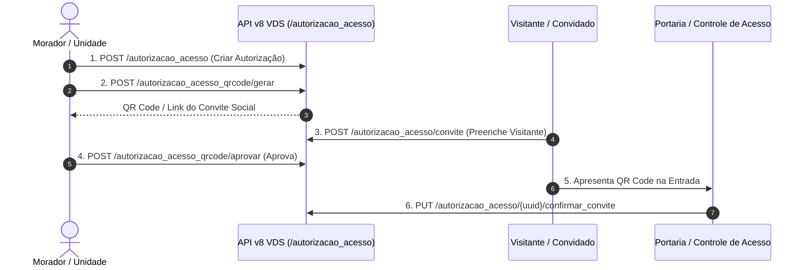

# Plano de Implementação: Super-Enriquecimento da Coleção Postman via Swagger OpenAPI v8

A partir da especificação pública obtida na URL `https://apiv8.vds.app.br/swagger/public/swagger.json` (OpenAPI 3.0.1 com 39 endpoints e 60 schemas), super-enriqueceremos a coleção Postman do projeto (`docs/vds_api_v8_postman_collection.json`).

O objetivo é integrar 100% das definições oficiais fornecidas pelo Swagger (incluindo 30 novos endpoints de Gestão de Autorização de Acesso, Convites Sociais, QR Codes, Perfis e Obras), preservando simultaneamente as requisições híbridas inspecionadas via dev tools no navegador (como Ocorrências, Entregas, Boletos e Calendários de Reservas).

---

## User Review Required & Resposta sobre Reservas x Fila de Espera

> [!IMPORTANT]
> **Comportamento da Reserva vs. Fila de Espera na VDS**:
> 1. **Endpoint Único (`POST /reserva`)**: A documentação Swagger OpenAPI pública não inclui o endpoint `POST /reserva`. No entanto, com base nas requisições reais que capturamos e testamos no Postman (Item 6.10), o endpoint de escrita é **único** (`POST /reserva`).
> 2. **Enfileiramento Automático no Servidor**: Não existe um parâmetro/flag no payload para "forçar" ou "evitar" a fila de espera. Se a área comum estiver desocupada, a VDS retorna `status: "Reserva aprovada"` (uuid 2). Se já houver um morador reservado para aquele horário, o servidor enfileira o solicitante automaticamente e retorna `status: "Fila de espera"` (uuid 5).
> 3. **Consultas com Filtros em `GET /reserva`**: A documentação Swagger oficializa a consulta paginada `GET /reserva` aceitando os parâmetros `Recurso.Uuid`, `DtIni`, `DtFim`, `Agendamento` (Reserva x Agendamento), `ReservaCalendario` e `Status`.

> [!NOTE]
> A coleção Postman resultante conterá **57+ requisições** organizadas semanticamente em 7 categorias. Nenhuma rota criada anteriormente por inspeção do navegador será removida; todas serão mantidas e combinadas com as especificações oficiais do Swagger.

---

## Diagramas de Fluxo Operacional (Mermaid)

### Fluxo de Reserva e Entrada em Fila de Espera

### Fluxo de Autorização de Acesso & QR Code

---

## Proposed Changes

### Coleção Postman (`docs/vds_api_v8_postman_collection.json`)

#### [MODIFY] [vds_api_v8_postman_collection.json](file:///e:/DEV/recMan/docs/vds_api_v8_postman_collection.json)
- Reorganizar e expandir a coleção Postman de 30 para **57+ requisições**.
- Adicionar schemas de request body em formato JSON com comentários e propriedades extraídas do Swagger OpenAPI para todos os endpoints `POST` / `PUT`.
- Adicionar documentação em markdown para cada rota com base nos `summary` e `description` do Swagger.
- Incluir query parameters oficiais detalhados em requisições `GET`.

#### [MODIFY] [SKILL.md](file:///e:/DEV/recMan/skills/vds_api_v8/SKILL.md)
- Atualizar a skill de documentação técnica da API v8 Vida de Síndico para registrar os 30 novos endpoints de Autorização de Acesso, QR Code, Convites Sociais, Obras e Perfis.

#### [NEW] [.agents/planos_e_workflows/workflows/2026-07-30_fluxo_reservas_e_autorizacao_vds.md](file:///e:/DEV/recMan/.agents/planos_e_workflows/workflows/2026-07-30_fluxo_reservas_e_autorizacao_vds.md)
- Fluxogramas operacionais em Mermaid salvos no repositório do agente.

#### [NEW] [.agents/planos_e_workflows/planos/2026-07-30_enriquecimento_postman_swagger.md](file:///e:/DEV/recMan/.agents/planos_e_workflows/planos/2026-07-30_enriquecimento_postman_swagger.md)
- Cópia versionada do plano de implementação no diretório do agente.

---

## Verification Plan

### Automated Tests
- Executar script de validação de sintaxe e estrutura JSON (`python -m json.tool docs/vds_api_v8_postman_collection.json`).
- Verificar que todas as 57+ rotas possuem URLs válidas, variáveis de ambiente configuradas (`{{baseUrl}}`, `{{bearerToken}}`, etc.) e headers padrão (`Authorization`, `Content-Type`).

### Manual Verification
- Importar a coleção resultante no Postman/Insomnia/Bruno para testar a comunicação direta com `apiv8.vds.app.br`.
