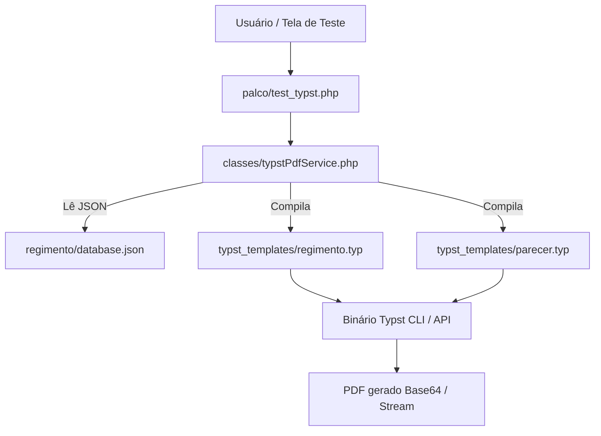

# Plano de Implementação: Microserviço/API Typst em Paralelo (Regimento e Pareceres)

- **Data**: 2026-09-20
- **Status**: Em Planejamento
- **Objetivo**: Implementar uma estrutura de geração de PDFs via Typst em paralelo, sem afetar o serviço existente em produção, permitindo testar variantes visuais e de performance usando `regimento/database.json` e Pareceres.

---

## 1. Visão Geral e Arquitetura

A solução consiste em criar uma camada de templates Typst nativos no repositório local e um wrapper PHP/API para integração e testes em paralelo.

---

## 2. Componentes a Criar

### 2.1 Templates Typst (`typst_templates/`)
- `typst_templates/regimento.typ`:
  - Template que lê o `regimento/database.json`.
  - Capa elegante com título e informações do condomínio.
  - Sumário / Índice gerado dinamicamente.
  - Estilização de Capítulos (fonte em destaque, maiúsculas, espaçamento adequado).
  - Estilização de Artigos e Parágrafos com recuo de primeira linha e numeração clara.
  - Rodapé dinâmico "Página X de Y".

- `typst_templates/parecer.typ`:
  - Template específico para emissão de pareceres de notificações/recursos.
  - Cabeçalho com dados da Notificação, Unidade e Assunto em caixa de destaque.
  - Seções formais: **Fato**, **Fundamentação / Análise**, **Votação / Parecer**.
  - Bloco final para data e assinatura dos conselheiros.

### 2.2 Wrapper Service em PHP (`classes/typstPdfService.php`)
- Classe responsável por encapsular a chamada ao Typst:
  - Método `gerarPdfRegimento($dadosJsonPath, $opcoes)`
  - Método `gerarPdfParecer($dadosParecerArray, $opcoes)`
  - Verificação e fallback gracioso (valida se o binário `typst` está disponível no ambiente local ou remoto).

### 2.3 Endpoint / Interface de Teste (`palco/test_typst.php`)
- Interface web simples e funcional acessível pelos desenvolvedores/conselheiros para:
  - Selecionar variantes de layout (ex: "Regimento Clássico", "Regimento Moderno Dark/Light", "Parecer Padrão").
  - Visualizar o PDF inline no navegador.
  - Comparar tempo de geração (exibe tempo de compilação em ms).

---

## 3. Plano de Teste e Validação
1. **Teste do Regimento Interno:** Compilar o PDF completo a partir do `regimento/database.json` (33 capítulos e centenas de artigos) para medir velocidade e atestar que a paginação não possui falhas visuais.
2. **Teste do Parecer de Recurso:** Compilar um parecer de teste com dados simulados e comparar visualmente com o PDF gerado pelo serviço atual (`pdfParecer.php`).
3. **Verificação de Ausência de Efeitos Colaterais:** Garantir que o fluxo produtivo em `palco/emiteParecer.php` continue intocado até o aceite final.
