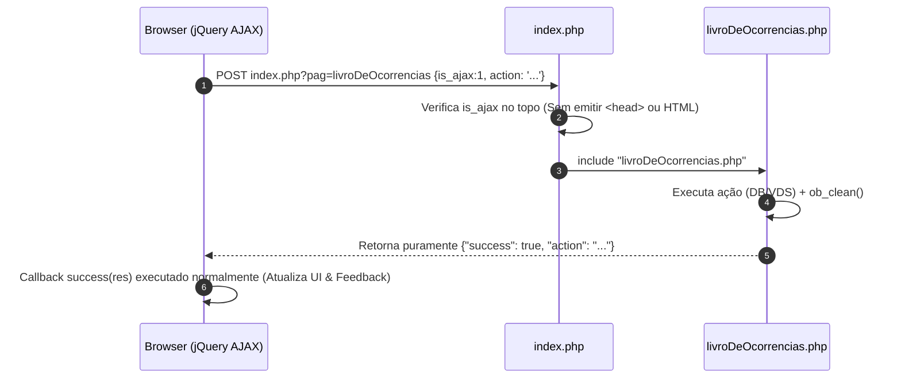

# Walkthrough - Resposta JSON Limpa nas Ações AJAX do Livro de Ocorrências

**Data:** 2026-07-31  
**Escopo:** `index.php` e `livroDeOcorrencias.php`  
**Objetivo:** Eliminar a injeção de HTML no início das respostas JSON retornadas pelas ações AJAX de Responsabilidade, Resolver Local e Marcar como Lido.

---

## 1. Alterações Realizadas

### [index.php](file:///e:/DEV/recMan/index.php)
- **Roteamento AJAX de Topo:** Movida a tag `<?php` para a linha 1 e adicionada a verificação `if (!empty($_REQUEST['is_ajax']))` antes de renderizar qualquer elemento HTML (`<head>`, `<main>`, scripts ou include do menu `usuarioLogado.php`).
- **Retorno Direto:** Se a requisição contiver `is_ajax=1` e o módulo for `livroDeOcorrencias`, o script valida a sessão e inclui diretamente o `livroDeOcorrencias.php`, encerrando com `exit()`.

### [livroDeOcorrencias.php](file:///e:/DEV/recMan/livroDeOcorrencias.php)
- **Limpeza de Buffer:** Adicionado `if (ob_get_length()) ob_clean();` nos blocos de processamento AJAX de:
  - `atualizar_responsabilidade` (Linha ~71)
  - `marcar_resolvido` (Linha ~96)
  - `marcar_como_lido` (Linha ~117)
- Garante zero contaminação de espaço em branco ou saídas residuais de buffer antes da emissão do cabeçalho `Content-Type: application/json` e da resposta em JSON.

---

## 2. Fluxo das Requisições Após a Correção

---

## 3. Verificação e Testes

- **Botão Responsabilidade (Pendente / Síndico / Sub):** O clique envia `action: 'atualizar_responsabilidade'` e recebe JSON puro, permitindo que a função `executarAcaoAjaxResponsabilidade` aplique as classes CSS e o rótulo de texto em tempo real.
- **Botão Resolver Local:** O clique envia `action: 'marcar_resolvido'` e recebe JSON puro, alternando o ícone para `undo` / `check_circle` e a cor do status sem cair no erro de parse do jQuery.
- **Botão Marcar Lido (VDS):** O clique envia `action: 'marcar_como_lido'` e recebe JSON puro, atualizando o badge de leitura remote e executando o fade in/out na visão prática.
