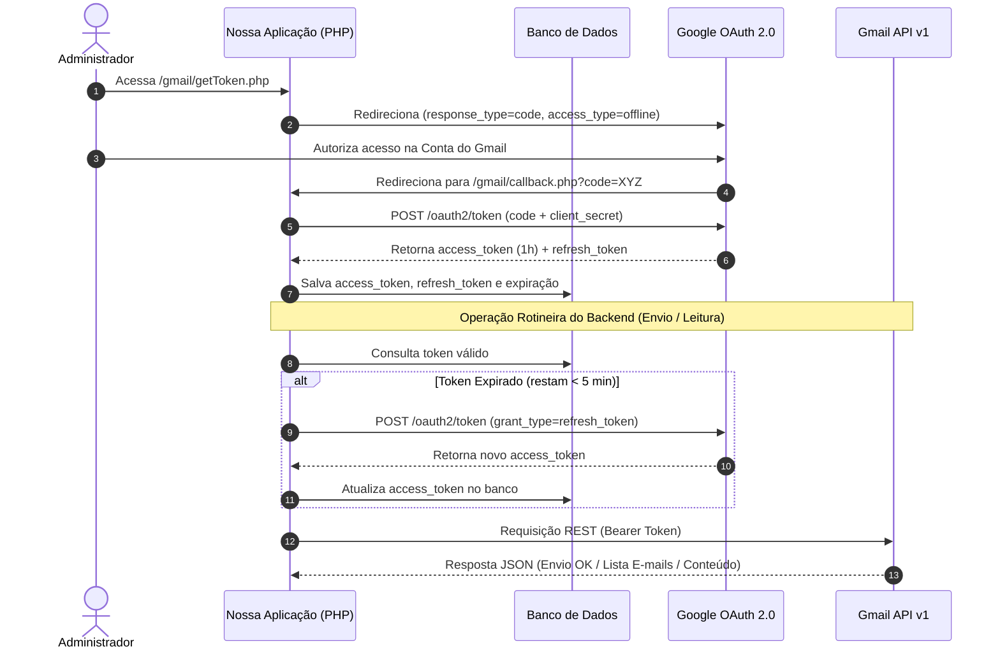

# Guia Completo de Integração com a API Oficial do Gmail (OAuth 2.0 + PHP)

Este tutorial foi elaborado com base no padrão arquitetural adotado no projeto **recMan**. Ele fornece um passo a passo prático e completo para configurar, autenticar e consumir a API Oficial do Gmail para **enviar e ler e-mails** de forma automatizada em aplicações web.

---

## Sumário

1. [Visão Geral da Arquitetura](#1-visão-geral-da-arquitetura)
2. [Passo 1: Configuração no Google Cloud Console](#passo-1-configuração-no-google-cloud-console)
3. [Passo 2: Lista de Escopos e Endpoints Utilizados](#passo-2-lista-de-escopos-e-endpoints-utilizados)
4. [Passo 3: Modelagem de Dados para Armazenamento de Tokens](#passo-3-modelagem-de-dados-para-armazenamento-de-tokens)
5. [Passo 4: Fluxo de Autenticação OAuth 2.0 (Authorization Code + Offline)](#passo-4-fluxo-de-autenticação-oauth-20-authorization-code--offline)
   - [4.1 Gerar URL de Autorização (`getToken.php`)](#41-gerar-url-de-autorização-gettokenphp)
   - [4.2 Processar Callback e Obter Tokens (`callback.php`)](#42-processar-callback-e-obter-tokens-callbackphp)
   - [4.3 Checagem de Expiração e Renovação Automática (`refresh.php`)](#43-checagem-de-expiração-e-renovação-automática-refreshphp)
6. [Passo 5: Operações do Gmail (Envio e Leitura)](#passo-5-operações-do-gmail-envio-e-leitura)
   - [5.1 Construção e Envio de E-mail MIME RFC822](#51-construção-e-envio-de-e-mail-mime-rfc822)
   - [5.2 Busca de E-mails por Termo/Protocolo](#52-busca-de-e-mails-por-termoprotocolo)
   - [5.3 Leitura do Conteúdo Completo (Decodificação Base64URL)](#53-leitura-do-conteúdo-completo-decodificação-base64url)
7. [Boas Práticas e Cuidados Importantes](#boas-práticas-e-cuidados-importantes)

---

## 1. Visão Geral da Arquitetura

Para que um sistema backend consiga ler e enviar e-mails em nome de uma conta do Gmail de forma **autônoma** (sem exigir que o usuário refaça login a cada 1 hora), utilizamos o fluxo de autorização **OAuth 2.0 Web Server Flow** com a opção `access_type=offline`.



---

## Passo 1: Configuração no Google Cloud Console

### 1.1 Criar o Projeto
1. Acesse o [Google Cloud Console](https://console.cloud.google.com/).
2. No menu superior, clique no seletor de projetos e selecione **Novo Projeto**.
3. Escolha um nome (ex: `MeuProjeto-Gmail-Integration`) e clique em **Criar**.

### 1.2 Ativar a API do Gmail
1. Na barra lateral esquerda, vá em **APIs e Serviços** > **Biblioteca**.
2. Pesquise por **Gmail API**.
3. Selecione a API do Gmail e clique no botão **Ativar**.

### 1.3 Configurar a Tela de Consentimento OAuth (OAuth Consent Screen)
1. Vá em **APIs e Serviços** > **Tela de permissão OAuth**.
2. Selecione o tipo de usuário:
   - **Interno** (Se sua empresa usa Google Workspace) ou
   - **Externo** (Para contas Gmail comuns `@gmail.com`).
3. Preencha as informações básicas do app:
   - Nome do aplicativo (ex: `RecMan Mailer`)
   - E-mail de suporte ao usuário
   - Dados de contato do desenvolvedor
4. Em **Escopos (Scopes)**, clique em **Adicionar ou Remover Escopos** e adicione:
   - `https://www.googleapis.com/auth/gmail.modify` (ou `gmail.send` / `gmail.readonly` conforme necessidade).
5. **Usuários de Teste (Test Users)** *(Importante para apps em estado de Teste/Externo)*:
   - Adicione o endereço de e-mail da conta do Gmail que será autorizada a enviar/ler e-mails.

### 1.4 Criar Credenciais OAuth 2.0
1. Vá em **APIs e Serviços** > **Credenciais**.
2. Clique em **Criar Credenciais** > **ID do cliente OAuth**.
3. Em **Tipo de aplicativo**, selecione **Aplicativo Web**.
4. Defina as **URIs de redirecionamento autorizados** (Callback URI):
   - Exemplo em desenvolvimento: `https://meudominio.com.br/gmail/callback.php`
5. Clique em **Criar**.
6. Guarde com segurança o **ID do Cliente (Client ID)** e o **Segredo do Cliente (Client Secret)**.

> ⚠️ **Atenção**: Nunca versione o `Client Secret` em repositórios públicos ou abertos. Guarde-o em um arquivo de configuração protegido ou variável de ambiente (como `gmail/api.php` não commitado ou `.env`).

---

## Passo 2: Lista de Escopos e Endpoints Utilizados

### Escopos Importantes do Gmail

| Escopo | Permissões | Recomendado Para |
| :--- | :--- | :--- |
| `https://www.googleapis.com/auth/gmail.modify` | Leitura, envio, alteração de marcadores e exclusão de e-mails. | **Uso geral** (Permite ler, enviar e organizar). |
| `https://www.googleapis.com/auth/gmail.send` | Apenas envio de e-mails em nome do usuário. | Aplicações que **somente enviam** notificações. |
| `https://www.googleapis.com/auth/gmail.readonly` | Apenas leitura e busca de e-mails. | Aplicações de consulta/auditoria de e-mails. |

### Endpoints da API

#### Endpoints de Autenticação OAuth 2.0 (Google OAuth)
- **URL de Autorização (Consentimento)**: `GET https://accounts.google.com/o/oauth2/auth`
- **URL de Troca/Renovação de Token**: `POST https://oauth2.googleapis.com/token`

#### Endpoints da API v1 do Gmail (`https://gmail.googleapis.com` / `upload.googleapis.com`)
- **Envio de E-mail MIME**:
  `POST https://www.googleapis.com/upload/gmail/v1/users/me/messages/send?uploadType=media`
  - *Header*: `Content-Type: message/rfc822`
  - *Header*: `Authorization: Bearer {ACCESS_TOKEN}`
- **Busca/Listagem de Mensagens**:
  `GET https://gmail.googleapis.com/gmail/v1/users/me/messages?q={QUERY}&maxResults={N}`
  - *Header*: `Authorization: Bearer {ACCESS_TOKEN}`
- **Obter Metadados da Mensagem**:
  `GET https://gmail.googleapis.com/gmail/v1/users/me/messages/{MESSAGE_ID}?format=metadata&metadataHeaders=Subject&metadataHeaders=From&metadataHeaders=Date`
  - *Header*: `Authorization: Bearer {ACCESS_TOKEN}`
- **Obter Conteúdo Completo (Corpo/Anexos)**:
  `GET https://gmail.googleapis.com/gmail/v1/users/me/messages/{MESSAGE_ID}?format=full`
  - *Header*: `Authorization: Bearer {ACCESS_TOKEN}`

---

## Passo 3: Modelagem de Dados para Armazenamento de Tokens

Para gerenciar a autenticação persistente, crie uma tabela SQL para guardar o `access_token` e o `refresh_token`.

```sql
CREATE TABLE IF NOT EXISTS `tokens` (
  `id` INT AUTO_INCREMENT PRIMARY KEY,
  `access_token` TEXT NOT NULL,
  `expires_in` INT NOT NULL DEFAULT 3600,
  `scope` TEXT NULL,
  `token_type` VARCHAR(50) DEFAULT 'Bearer',
  `refresh_token` TEXT NULL,
  `created_at` TIMESTAMP DEFAULT CURRENT_TIMESTAMP ON UPDATE CURRENT_TIMESTAMP
) ENGINE=InnoDB DEFAULT CHARSET=utf8mb4;
```

---

## Passo 4: Fluxo de Autenticação OAuth 2.0 (Authorization Code + Offline)

### 4.1 Gerar URL de Autorização (`getToken.php`)

Este script inicia o fluxo redirecionando o administrador para o Google. É crucial passar `'access_type' => 'offline'` para receber o `refresh_token`.

```php
<?php
// gmail/getToken.php
require_once __DIR__ . '/api.php'; // Contém $clientId e $clientSecret

$redirectUri = 'https://meudominio.com.br/gmail/callback.php';
$authorizationEndpoint = 'https://accounts.google.com/o/oauth2/auth';

$authorizationParams = [
    'response_type' => 'code',
    'client_id'     => $clientId,
    'redirect_uri'  => $redirectUri,
    'scope'         => 'https://www.googleapis.com/auth/gmail.modify',
    'access_type'   => 'offline',
    'prompt'        => 'consent' // Força o consentimento para garantir envio do refresh_token
];

$authorizationUrl = $authorizationEndpoint . '?' . http_build_query($authorizationParams);

// Redireciona o usuário para o Google
header('Location: ' . $authorizationUrl);
exit;
```

---

### 4.2 Processar Callback e Obter Tokens (`callback.php`)

Após a autorização, o Google redireciona de volta para a sua URI de callback com o parâmetro `?code=...`. O backend faz uma requisição POST no servidor do Google para trocar esse código pelos tokens.

```php
<?php
// gmail/callback.php
require_once __DIR__ . '/api.php';
require_once __DIR__ . '/../classes/repositorio.php';

$redirectUri = 'https://meudominio.com.br/gmail/callback.php';

if (!isset($_GET['code'])) {
    die('Código de autorização não recebido.');
}

$code = $_GET['code'];
$tokenEndpoint = 'https://oauth2.googleapis.com/token';

$params = [
    'code'          => $code,
    'client_id'     => $clientId,
    'client_secret' => $clientSecret,
    'redirect_uri'  => $redirectUri,
    'grant_type'    => 'authorization_code',
];

$ch = curl_init($tokenEndpoint);
curl_setopt_array($ch, [
    CURLOPT_RETURNTRANSFER => true,
    CURLOPT_POST           => true,
    CURLOPT_POSTFIELDS     => $params
]);

$response = curl_exec($ch);
curl_close($ch);

$tokenData = json_decode($response, true);

if (isset($tokenData['access_token'])) {
    $accessToken  = $tokenData['access_token'];
    $expiresIn   = $tokenData['expires_in'];
    $scope       = $tokenData['scope'];
    $tokenType   = $tokenData['token_type'];
    $refreshToken = $tokenData['refresh_token'] ?? 'NULL';

    // Função de persistência no banco de dados
    upsertGmailToken($accessToken, $expiresIn, $scope, $tokenType, $refreshToken);

    echo "Autorização concluída com sucesso! Token armazenado.";
} else {
    echo "Erro ao obter token: " . print_r($tokenData, true);
}
```

---

### 4.3 Checagem de Expiração e Renovação Automática (`refresh.php`)

Os `access_tokens` do Google expiram em **3600 segundos (1 hora)**. Antes de qualquer requisição à API, verificamos o tempo restante. Se restarem menos de 5 minutos, executamos a renovação usando o `refresh_token`.

```php
<?php
// Função auxiliar de checagem do token (em repositorio.php)
function verificarToken() {
    $tokenData = getLastTokenFromDatabase();
    if (!$tokenData) {
        return ['status' => false, 'tkn' => null, 'resta' => 0];
    }

    $createdAt = strtotime($tokenData['created_at']);
    $expirationTime = $createdAt + (int)$tokenData['expires_in'];
    $timeRemaining = $expirationTime - time();

    // Se restar menos de 300 segundos (5 min), renova o token
    if ($timeRemaining <= 300) {
        $novoAccessToken = renovarTokenGmail();
        if ($novoAccessToken) {
            $tokenData['access_token'] = $novoAccessToken;
            $timeRemaining = 3600;
        }
    }

    return [
        'status' => ($timeRemaining > 0),
        'resta'  => $timeRemaining,
        'tkn'    => $tokenData['access_token']
    ];
}

// Função de Refresh via cURL
function renovarTokenGmail() {
    require __DIR__ . '/../gmail/api.php';
    $refreshToken = getLastRefreshTokenFromDatabase();

    if (!$refreshToken || $refreshToken === 'NULL') {
        return false;
    }

    $tokenEndpoint = 'https://oauth2.googleapis.com/token';
    $params = [
        'client_id'     => $clientId,
        'client_secret' => $clientSecret,
        'refresh_token' => $refreshToken,
        'grant_type'    => 'refresh_token',
    ];

    $ch = curl_init($tokenEndpoint);
    curl_setopt_array($ch, [
        CURLOPT_RETURNTRANSFER => true,
        CURLOPT_POST           => true,
        CURLOPT_POSTFIELDS     => $params
    ]);
    $response = curl_exec($ch);
    curl_close($ch);

    $tokenData = json_decode($response, true);
    if (isset($tokenData['access_token'])) {
        upsertGmailToken(
            $tokenData['access_token'],
            $tokenData['expires_in'],
            $tokenData['scope'] ?? '',
            $tokenData['token_type'] ?? 'Bearer',
            'NULL' // Mantém o refresh_token anterior
        );
        return $tokenData['access_token'];
    }
    return false;
}
```

---

## Passo 5: Operações do Gmail (Envio e Leitura)

Abaixo está a classe utilitária baseada no `MailHelper` do recMan.

### 5.1 Construção e Envio de E-mail MIME RFC822

Para enviar e-mails HTML com formatação e anexos via REST API sem bibliotecas pesadas, montamos uma mensagem MIME bruta no padrão RFC822 e enviamos com `uploadType=media`.

```php
<?php
// classes/MailHelper.php

class MailHelper {

    /**
     * Monta a mensagem MIME RFC822 bruta com suporte a HTML e anexos
     */
    public static function buildMimeMessage($to, $subject, $bodyHtml, $cc = [], $bcc = [], $attachments = []) {
        $boundary = uniqid('np_recman_');

        $headers  = "To: $to\r\n";
        if (!empty($cc)) {
            $headers .= "Cc: " . implode(', ', $cc) . "\r\n";
        }
        if (!empty($bcc)) {
            $headers .= "Bcc: " . implode(', ', $bcc) . "\r\n";
        }
        $encodedSubject = "=?UTF-8?B?" . base64_encode($subject) . "?=";
        $headers .= "Subject: $encodedSubject\r\n";
        $headers .= "MIME-Version: 1.0\r\n";
        $headers .= "Content-Type: multipart/mixed; boundary=\"$boundary\"\r\n\r\n";

        // Corpo em HTML (base64)
        $message  = $headers . "--$boundary\r\n";
        $message .= "Content-Type: text/html; charset=UTF-8\r\n";
        $message .= "Content-Transfer-Encoding: base64\r\n\r\n";
        $message .= chunk_split(base64_encode($bodyHtml)) . "\r\n";

        // Processar anexos
        foreach ($attachments as $attachment) {
            if (file_exists($attachment['path'])) {
                $filename = $attachment['name'];
                $content = chunk_split(base64_encode(file_get_contents($attachment['path'])));

                $message .= "--$boundary\r\n";
                $message .= "Content-Type: application/octet-stream; name=\"$filename\"\r\n";
                $message .= "Content-Description: $filename\r\n";
                $message .= "Content-Disposition: attachment; filename=\"$filename\"; size=" . filesize($attachment['path']) . ";\r\n";
                $message .= "Content-Transfer-Encoding: base64\r\n\r\n";
                $message .= "$content\r\n\r\n";
            }
        }

        $message .= "--$boundary--";
        return $message;
    }

    /**
     * Envia mensagem MIME bruta via Gmail API v1
     */
    public static function sendViaGmail($mimeMessage) {
        $gmail = verificarToken();
        if (!$gmail['status'] || empty($gmail['tkn'])) {
            return ['error' => 'Token do Gmail inválido ou não configurado'];
        }

        $curl = curl_init();
        curl_setopt_array($curl, [
            CURLOPT_URL            => 'https://www.googleapis.com/upload/gmail/v1/users/me/messages/send?uploadType=media',
            CURLOPT_RETURNTRANSFER => true,
            CURLOPT_CUSTOMREQUEST  => 'POST',
            CURLOPT_POSTFIELDS     => $mimeMessage,
            CURLOPT_HTTPHEADER     => [
                'Content-Type: message/rfc822',
                'Authorization: Bearer ' . $gmail['tkn']
            ],
        ]);

        $response = curl_exec($curl);
        $err = curl_error($curl);
        curl_close($curl);

        if ($err) {
            return ['error' => 'Erro cURL: ' . $err];
        }

        return json_decode($response, true);
    }
}
```

---

### 5.2 Busca de E-mails por Termo/Protocolo

Permite pesquisar mensagens na caixa de entrada usando operadores de busca do Gmail (ex: `subject:"Protocolo-1234"` ou termos gerais).

```php
    /**
     * Pesquisa mensagens no Gmail por protocolo ou assunto
     */
    public static function searchMessagesByProtocolo($protocolo) {
        $gmail = verificarToken();
        if (!$gmail['status']) {
            return ['found' => false, 'error' => 'Token do Gmail inválido'];
        }

        $token = $gmail['tkn'];
        $query = 'subject:"' . trim($protocolo) . '"';
        $url   = 'https://gmail.googleapis.com/gmail/v1/users/me/messages?q=' . urlencode($query) . '&maxResults=5';

        $ch = curl_init();
        curl_setopt_array($ch, [
            CURLOPT_URL            => $url,
            CURLOPT_RETURNTRANSFER => true,
            CURLOPT_HTTPHEADER     => ['Authorization: Bearer ' . $token],
            CURLOPT_TIMEOUT        => 8
        ]);
        $response = curl_exec($ch);
        curl_close($ch);

        $resJson  = json_decode($response, true);
        $messages = $resJson['messages'] ?? [];

        if (empty($messages)) {
            return ['found' => false];
        }

        // Pega a mensagem mais recente
        $msgId   = $messages[0]['id'];
        $metaUrl = "https://gmail.googleapis.com/gmail/v1/users/me/messages/{$msgId}?format=metadata&metadataHeaders=Subject&metadataHeaders=From&metadataHeaders=Date";

        $ch = curl_init();
        curl_setopt_array($ch, [
            CURLOPT_URL            => $metaUrl,
            CURLOPT_RETURNTRANSFER => true,
            CURLOPT_HTTPHEADER     => ['Authorization: Bearer ' . $token]
        ]);
        $metaResp = curl_exec($ch);
        curl_close($ch);

        $metaJson = json_decode($metaResp, true);
        $subject  = '(Sem Assunto)';
        $from     = '';
        $date     = '';

        if (!empty($metaJson['payload']['headers'])) {
            foreach ($metaJson['payload']['headers'] as $h) {
                $name = strtolower($h['name']);
                if ($name === 'subject') $subject = $h['value'];
                if ($name === 'from')    $from    = $h['value'];
                if ($name === 'date')    $date    = $h['value'];
            }
        }

        return [
            'found'       => true,
            'id'          => $msgId,
            'subject'     => $subject,
            'from'        => $from,
            'date'        => $date,
            'snippet'     => $metaJson['snippet'] ?? '',
            'webLink'     => "https://mail.google.com/mail/#inbox/" . $msgId
        ];
    }
```

---

### 5.3 Leitura do Conteúdo Completo (Decodificação Base64URL)

O Gmail retorna as partes da mensagem codificadas no formato **Base64URL Safe** (onde `+` é substituído por `-` e `/` por `_`). É essencial converter os caracteres antes de chamar `base64_decode()`.

```php
    /**
     * Obtém o conteúdo completo HTML/Texto de um e-mail pelo ID
     */
    public static function getMessageContent($messageId) {
        $gmail = verificarToken();
        if (!$gmail['status']) {
            return ['success' => false, 'error' => 'Token inválido'];
        }

        $url = "https://gmail.googleapis.com/gmail/v1/users/me/messages/{$messageId}?format=full";
        $ch  = curl_init();
        curl_setopt_array($ch, [
            CURLOPT_URL            => $url,
            CURLOPT_RETURNTRANSFER => true,
            CURLOPT_HTTPHEADER     => ['Authorization: Bearer ' . $gmail['tkn']]
        ]);
        $response = curl_exec($ch);
        curl_close($ch);

        $json = json_decode($response, true);
        if (!$json || empty($json['id'])) {
            return ['success' => false, 'error' => 'Mensagem não encontrada'];
        }

        $htmlBody = '';
        $textBody = '';
        self::extractBodyParts($json['payload'], $htmlBody, $textBody);

        $bodyFinal = !empty($htmlBody) ? $htmlBody : (!empty($textBody) ? nl2br(htmlspecialchars($textBody)) : '<em>(E-mail sem conteúdo)</em>');

        return [
            'success' => true,
            'id'      => $json['id'],
            'snippet' => $json['snippet'] ?? '',
            'body'    => $bodyFinal,
            'webLink' => "https://mail.google.com/mail/#inbox/" . $json['id']
        ];
    }

    /**
     * Função recursiva para decodificar partes multipartes do e-mail
     */
    private static function extractBodyParts($part, &$htmlBody, &$textBody) {
        if (!empty($part['body']['data'])) {
            // CONVERSÃO DE BASE64URL PARA BASE64 PADRÃO
            $data = strtr($part['body']['data'], '-_', '+/');
            $decoded = base64_decode($data);

            if (!empty($part['mimeType'])) {
                if ($part['mimeType'] === 'text/html' && empty($htmlBody)) {
                    $htmlBody = $decoded;
                } elseif ($part['mimeType'] === 'text/plain' && empty($textBody)) {
                    $textBody = $decoded;
                }
            }
        }

        if (!empty($part['parts']) && is_array($part['parts'])) {
            foreach ($part['parts'] as $subPart) {
                self::extractBodyParts($subPart, $htmlBody, $textBody);
            }
        }
    }
```

---

## Boas Práticas e Cuidados Importantes

1. **Obtenção do Refresh Token**: O Google só envia o `refresh_token` na **primeira autorização**. Se você perder esse token ou reiniciar o banco, passe `'prompt' => 'consent'` na URL de autorização para forçar a entrega de um novo `refresh_token`.
2. **Decodificação Base64URL**: Nunca faça `base64_decode()` direto nos campos `data` retornados pela API do Gmail sem antes aplicar `strtr($data, '-_', '+/')`.
3. **Assunto com Acentos**: No padrão MIME RFC822, assuntos com caracteres acentuados ou especiais devem ser codificados com `=?UTF-8?B?` . base64_encode($subject) . `?=` para evitar caracteres corrompidos em leitores como Outlook/Webmail.
4. **Modo de Envio `uploadType=media`**: Enviar via `POST /upload/gmail/v1/users/me/messages/send?uploadType=media` com `Content-Type: message/rfc822` é a forma mais simples e robusta de enviar e-mails ricos em HTML com múltiplos anexos sem precisar formatar objetos JSON complexos.
5. **Limites da API (Quotas)**: A API do Gmail possui limite diário de unidades de cota (ex: 1,000,000 quota units/dia). Um envio de e-mail consome 100 quota units, enquanto uma listagem consome 5 quota units.

---
*Tutorial criado para referência de integração com a API Oficial do Gmail baseado na arquitetura recMan.*
