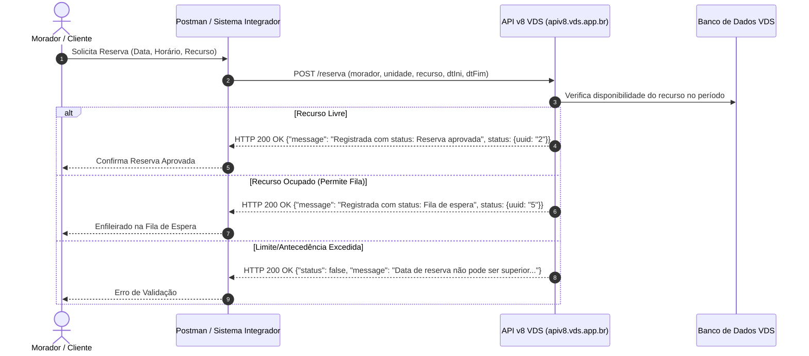
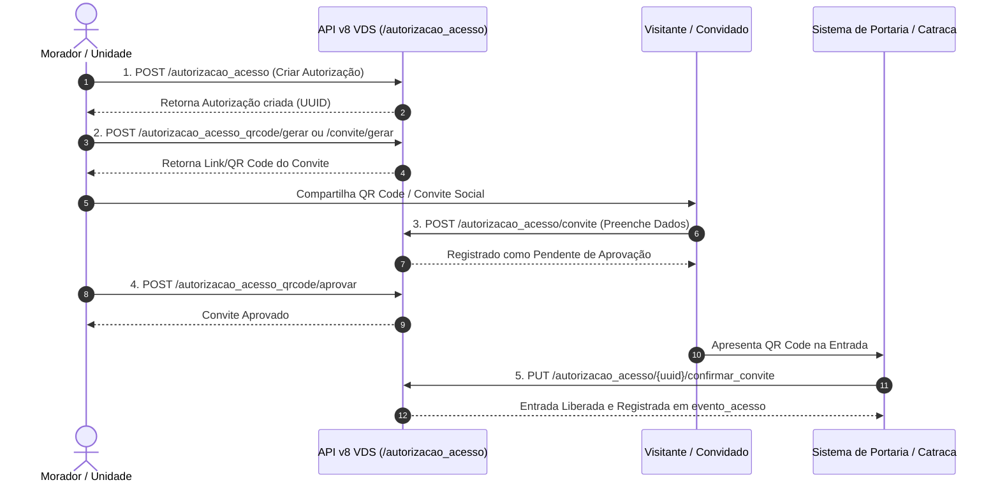

# Workflows da API v8 Vida de Síndico (VDS)

- **Data**: 2026-07-30
- **Tópico**: Fluxos operacionais de Reservas/Fila de Espera e Autorizações de Acesso / Convites

---

## 1. Fluxo de Reserva & Fila de Espera Automatizada

O endpoint `POST /reserva` é unificado no backend da VDS. O servidor determina autonomamente se o morador obtém a reserva aprovada ou entra na fila de espera.

---

## 2. Fluxo de Autorização de Acesso, Convite Social & QR Code

Fluxo completo de criação de autorização de acesso a visitantes, geração de QR Code/convite, aprovação e notificação por e-mail.

