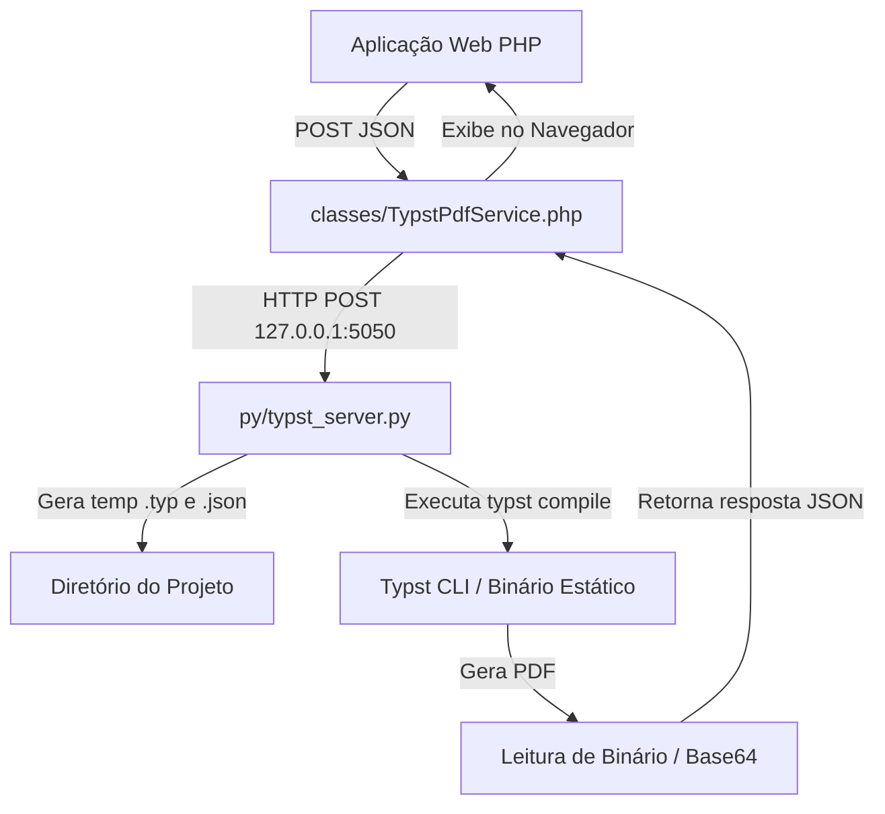

# Skill: Geração de PDFs de Alta Performance com Typst CLI

Esta skill especifica o padrão de arquitetura, microserviço Python na porta 5050, wrapper PHP e convenções de templates `.typ` para geração ultra-rápida (10-50ms) e tipograficamente perfeita de documentos em PDF (Pareceres, Notificações, Regimentos Internos e Relatórios) usando o **Typst**.

---

## 1. Visão Geral da Arquitetura

A solução é desenhada para rodar em paralelo sem afetar o serviço de produção legado:



---

## 2. Catálogo de 8 Variantes Visuais de Layout

O sistema suporta 8 variantes de design através do parâmetro `variant` no payload JSON:

| Variante | Nome Visual | Estilo e Destaques |
| :--- | :--- | :--- |
| `modern` | Moderno (Padrão) | Imagem de topo `LayoutMiami.jpg`, capa noturna elegante (`#0f172a`), bordas arredondadas e tabelas modernas. |
| `classic` | Clássico / Notarial | Estilo tradicional sóbrio sem imagens, molduras azuis (`#1e3a8a`), ótimo para atos normativos clássicos. |
| `compact` | Compacto / Executivo | Layout denso focado em economia de páginas, sem capa separada, ideal para pareceres curtos. |
| `corporate` | Corporativo | Estilo institucional empresarial com destaques e faixas em Azul Royal (`#1e40af`). |
| `minimal` | Minimalista / Clean | Design nórdico ultra-limpo em tons de cinza suave (`#475569`), linhas ultrafinas e visual leve. |
| `juridico` | Jurídico Solene | Formatação solene de cartório/tribunal com moldura dupla pesada e cabeçalhos formais. |
| `dark` | Dark Mode | Fundo escuro premium (`#0f172a`), texto claro e detalhes visuais em Ciano Neon (`#0284c7`). |
| `editorial` | Editorial / Boletim | Estilo publicação oficial / boletim informativo condominial com capa em Verde Esmeralda (`#065f46`). |

---

## 3. Instalação e Bootstrapping do Typst CLI no Linux

O Typst é distribuído como um único arquivo executável estático em Rust (sem dependências de pacotes GTK, Python ou Node).

### Comando de Instalação (1 Linha no Linux x86_64):
```bash
curl -L https://github.com/typst/typst/releases/latest/download/typst-x86_64-unknown-linux-musl.tar.xz | tar -xJ && cp typst-x86_64-unknown-linux-musl/typst /usr/local/bin/
```

Verifique a instalação com:
```bash
typst --version
```

---

## 4. Principais Desafios & Soluções de Sintaxe (Gotcha Reference)

Ao desenvolver templates `.typ` para Typst (especialmente v0.11+), atente-se às seguintes regras essenciais:

| Problema / Erro Comum | Causa no Typst | Solução Correta |
| :--- | :--- | :--- |
| `error: file not found (searched at ...)` | A função `#image()` dentro de um template resolve caminhos **relativos à pasta do próprio template** ou bloqueia acessos fora do projeto (sandbox). | Copiar a imagem para `typst_templates/sua_imagem.jpg` no backend e usar `#image("sua_imagem.jpg")`. |
| `only element functions can be used as selectors` | No Typst 0.11+, a função `locate(loc => ...)` foi descontinuada para headers/footers. | Utilizar blocos **`context`**: `footer: context { let page_number = counter(page).get().first() ... }`. |
| `unknown variable: art_texto` | No laço `for (...) [...]` (modo de marcação), declarações `let` são tratadas como texto literal. | Utilizar **chaves `{ ... }`** para laços em modo de código: `for (id, item) in lista { let txt = ... }`. |
| `error: unknown variable: f1f5f9` | O caractere `#` dentro de `rgb("#f1f5f9")` é lido no contexto de código como início de identificador. | Passar a string hex **sem cerquilha**: `fill: rgb("f1f5f9")`. |
| `unknown variable: art_idº` | Escrever `#art_idº` faz o parser incluir o caractere ordinal `º` no nome da variável. | Isolar a variável da marcação ordinal: `[Art. #art_id]º` ou `text(weight: "bold")[§ #p_key º]`. |
| `unexpected argument: margin` | A função nativa `block()` aceita `inset`, `outset`, `spacing`, `above`, `below`, mas não `margin`. | Utilizar **`below: 8pt`** ou **`above: 4pt`** para controle vertical entre blocos. |
| `the character # is not valid in code` | Usar `#` antes de funções (`#heading()`, `#v()`, `#outline()`) quando já se está dentro de um bloco `{ ... }`. | Remover o `#` inicial em blocos de código: `v(0.3cm)`, `outline(...)`, `pagebreak()`. |

---

## 5. Servidor Microserviço em Python (`py/typst_server.py`)

Servidor HTTP nativo em Python 3 na porta **5050** (usando apenas a biblioteca padrão `http.server`):

```python
#!/usr/bin/env python3
# -*- coding: utf-8 -*-
import os, sys, json, time, shutil, base64, subprocess, tempfile
from http.server import HTTPServer, BaseHTTPRequestHandler
from urllib.parse import parse_qs, urlparse

PORT = 5050
PY_DIR = os.path.dirname(os.path.abspath(__file__))
ROOT_DIR = os.path.abspath(os.path.join(PY_DIR, '..'))
TEMPLATES_DIR = os.path.join(ROOT_DIR, 'typst_templates')

def find_typst_binary():
    for p in [os.path.join(ROOT_DIR, 'bin', 'typst'), '/usr/local/bin/typst', '/usr/bin/typst', 'typst']:
        try:
            if subprocess.run([p, '--version'], capture_output=True).returncode == 0:
                return p
        except Exception: continue
    return None

TYPST_BIN = find_typst_binary()

def prepare_banner_image(input_data=None):
    dest = os.path.join(TEMPLATES_DIR, 'LayoutMiami.jpg')
    if os.path.exists(dest) and os.path.getsize(dest) > 0:
        return 'LayoutMiami.jpg'
    candidates = [
        input_data.get('banner_path', '') if input_data else '',
        '/var/www/reportPDFpython/LayoutMiami.jpg',
        os.path.join(ROOT_DIR, 'addons', 'api-pdf', 'LayoutMiami.jpg')
    ]
    for c in candidates:
        if c and os.path.exists(c):
            try:
                os.makedirs(TEMPLATES_DIR, exist_ok=True)
                shutil.copy2(c, dest)
                return 'LayoutMiami.jpg'
            except Exception: pass
    return 'LayoutMiami.jpg'

def run_typst(template_name, input_data=None):
    global TYPST_BIN
    if not TYPST_BIN: TYPST_BIN = find_typst_binary()
    if not TYPST_BIN: raise FileNotFoundError("Binário do Typst não encontrado!")

    start_time = time.time()
    template_path = os.path.join(TEMPLATES_DIR, template_name)
    if input_data is None: input_data = {}
    input_data['banner_path'] = prepare_banner_image(input_data)
    func_name = 'regimento-doc' if template_name == 'regimento.typ' else 'parecer-doc'

    try:
        f_json = tempfile.NamedTemporaryFile(dir=ROOT_DIR, prefix='tmp_data_', suffix='.json', mode='w', encoding='utf-8', delete=False)
        json.dump(input_data, f_json, ensure_ascii=False); f_json.close()
        rel_json = os.path.relpath(f_json.name, ROOT_DIR).replace('\\', '/')
        rel_tmpl = os.path.relpath(template_path, ROOT_DIR).replace('\\', '/')

        f_entry = tempfile.NamedTemporaryFile(dir=ROOT_DIR, prefix='tmp_entry_', suffix='.typ', mode='w', encoding='utf-8', delete=False)
        f_entry.write(f'#import "{rel_tmpl}": {func_name}\n#{func_name}(json("{rel_json}"))\n'); f_entry.close()

        f_pdf = tempfile.NamedTemporaryFile(dir=ROOT_DIR, prefix='tmp_out_', suffix='.pdf', delete=False); f_pdf.close()

        cmd = [TYPST_BIN, 'compile', '--root', ROOT_DIR, os.path.basename(f_entry.name), os.path.basename(f_pdf.name)]
        proc = subprocess.run(cmd, capture_output=True, text=True, cwd=ROOT_DIR)
        elapsed = round((time.time() - start_time) * 1000, 2)

        if proc.returncode != 0:
            raise RuntimeError(f"Erro no Typst: {proc.stderr.strip()}")

        with open(f_pdf.name, 'rb') as f: pdf_bytes = f.read()
        return pdf_bytes, elapsed

    finally:
        for p in [f_json.name, f_entry.name, f_pdf.name]:
            if os.path.exists(p):
                try: os.remove(p)
                except Exception: pass

class TypstHandler(BaseHTTPRequestHandler):
    def do_POST(self):
        len_b = int(self.headers.get('Content-Length', 0))
        data = json.loads(self.rfile.read(len_b).decode('utf-8')) if len_b > 0 else {}
        want_b64 = 'base64=true' in self.path
        try:
            tmpl = 'regimento.typ' if '/gerar_regimento' in self.path else 'parecer.typ'
            pdf_bytes, elapsed = run_typst(tmpl, data)
            if want_b64:
                res = {'status': 'success', 'elapsed_ms': elapsed, 'pdf_base64': base64.b64encode(pdf_bytes).decode('utf-8')}
                self.send_response(200); self.send_header('Content-Type', 'application/json'); self.end_headers()
                self.wfile.write(json.dumps(res).encode('utf-8'))
            else:
                self.send_response(200); self.send_header('Content-Type', 'application/pdf'); self.end_headers()
                self.wfile.write(pdf_bytes)
        except Exception as e:
            self.send_response(500); self.send_header('Content-Type', 'application/json'); self.end_headers()
            self.wfile.write(json.dumps({'status': 'error', 'message': str(e)}).encode('utf-8'))

if __name__ == '__main__':
    print(f"Servidor Typst iniciado na porta {PORT}...")
    HTTPServer(('0.0.0.0', PORT), TypstHandler).serve_forever()
```

---

## 6. Wrapper em PHP (`classes/TypstPdfService.php`)

```php
<?php
class TypstPdfService {
    private static $apiUrl = 'http://127.0.0.1:5050';

    public static function gerarParecer($dadosArray, $retornarBase64 = true) {
        return self::requisitar('/gerar_pdf' . ($retornarBase64 ? '?base64=true' : ''), $dadosArray);
    }

    public static function gerarRegimento($dadosArray = null, $retornarBase64 = true) {
        return self::requisitar('/gerar_regimento' . ($retornarBase64 ? '?base64=true' : ''), $dadosArray ?: []);
    }

    private static function requisitar($path, $payload) {
        $ch = curl_init(self::$apiUrl . $path);
        curl_setopt_array($ch, [
            CURLOPT_RETURNTRANSFER => true,
            CURLOPT_TIMEOUT => 30,
            CURLOPT_POST => true,
            CURLOPT_POSTFIELDS => json_encode($payload, JSON_UNESCAPED_UNICODE),
            CURLOPT_HTTPHEADER => ['Content-Type: application/json; charset=utf-8']
        ]);
        $res = curl_exec($ch);
        $code = curl_getinfo($ch, CURLINFO_HTTP_CODE);
        curl_close($ch);

        $json = json_decode($res, true);
        if ($code === 200 && is_array($json) && ($json['status'] ?? '') === 'success') {
            return $json;
        }
        return [
            'status' => 'error',
            'message' => $json['message'] ?? "Erro na comunicação com a API Typst (HTTP $code)"
        ];
    }
}
```

---

## 7. Checklist de Replicação para Novos Projetos

- [ ] Instalar o binário do Typst CLI em `/usr/local/bin/typst` no servidor remoto.
- [ ] Copiar a pasta `typst_templates/` com os arquivos `.typ` modelos.
- [ ] Subir o servidor Python `py/typst_server.py` na porta 5050 (ou configurá-lo como serviço systemd/supervisor).
- [ ] Incluir a classe `TypstPdfService.php` no projeto PHP para chamadas assíncronas/base64.
- [ ] Testar a saúde da API com `GET http://127.0.0.1:5050/health`.
